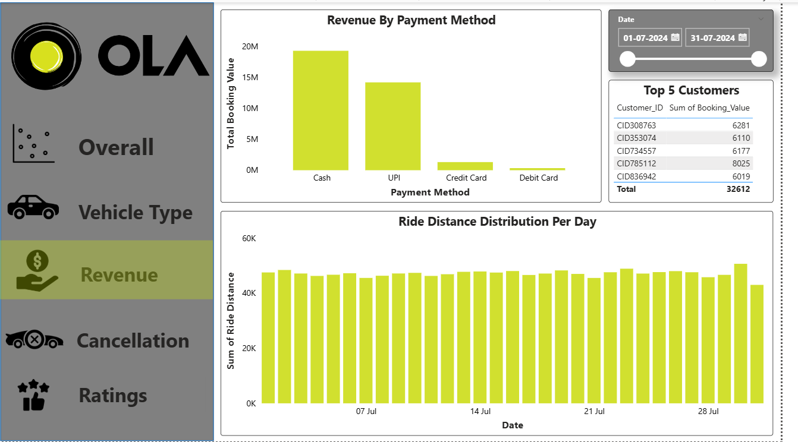
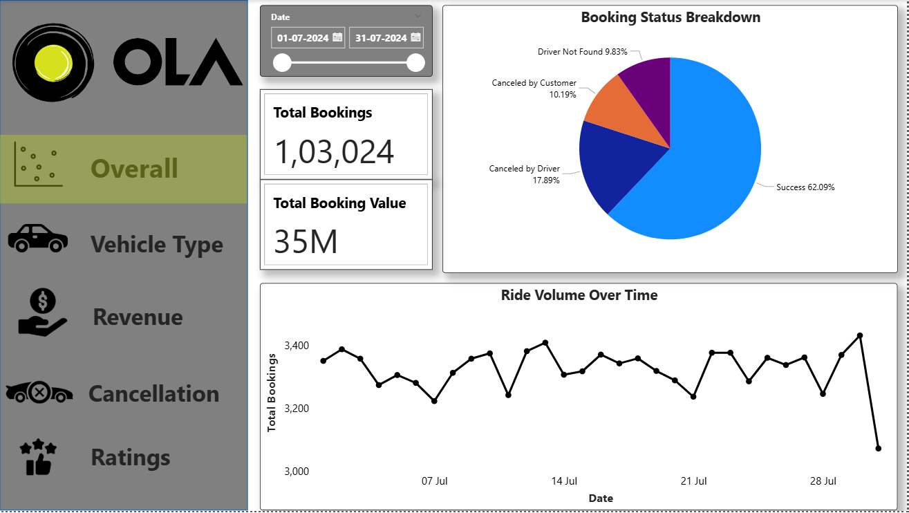
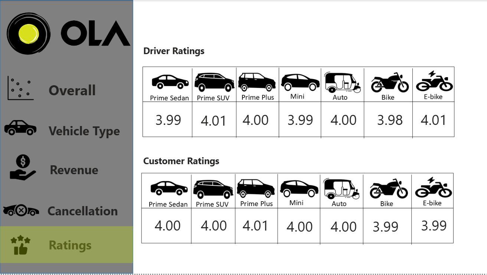
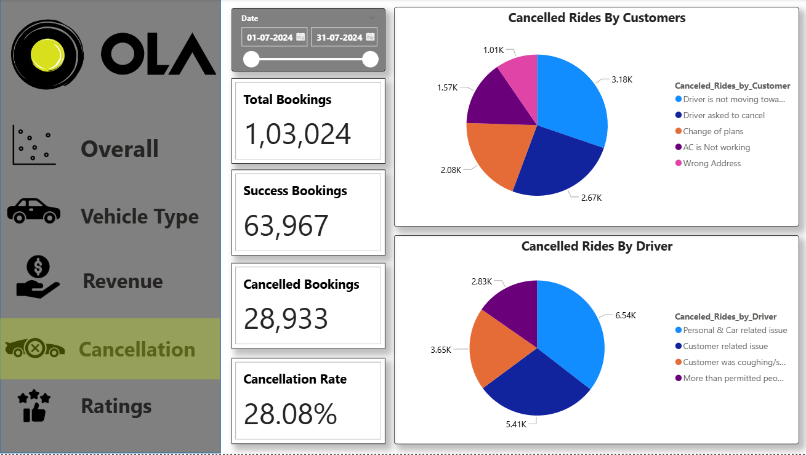
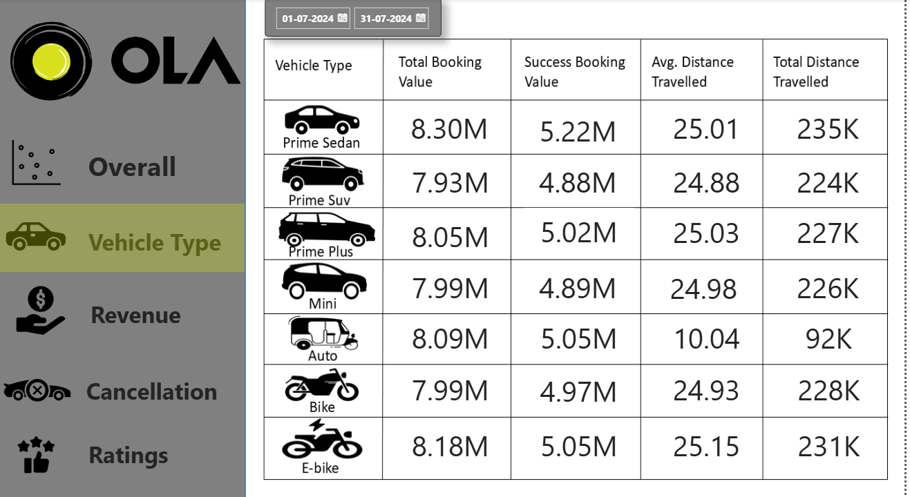

# 🚗 Ola Ride Analytics Dashboard

> An interactive Power BI dashboard analyzing 100,000+ Ola ride bookings to uncover revenue trends, cancellation patterns, and customer behavior insights.

---

## 📌 Objective

Ride-hailing platforms generate massive transactional data that often goes underutilized. This project answers key business questions:

- What is the overall revenue performance and how does it trend over time?
- Which factors are driving the ~28% cancellation rate?
- How do different ride categories and customer segments behave?
- What KPIs should operations and marketing teams monitor?

---

## 🛠️ Tools & Technologies


---

## 📁 Dataset

| Attribute | Detail |
|---|---|
| Records | 100,000+ ride bookings |
| Key Columns | Booking ID, Date, Ride Category, Booking Status, Revenue, Customer ID, Driver ID, Location |
| Source | Simulated Ola ride dataset |

---

## 📊 Dashboard Overview

The dashboard is divided into the following report pages:

### 1. Revenue Overview
- Total revenue: ₹35M+
- Month-over-month revenue trend
- Revenue split by ride category

### 2. Booking & Cancellation Analysis
- Total bookings vs completed rides
- ~28% cancellation rate identified
- Cancellation breakdown by reason (customer-initiated vs driver-initiated)
- Peak cancellation time slots highlighted

### 3. Ride Patterns
- Booking volume by hour, day, and month
- Top pickup and drop locations
- Average ride distance and duration

### 4. Customer Behavior
- Repeat vs one-time customers
- Customer booking frequency distribution
- Revenue contribution by customer segment

### 5. KPI Summary
- Completion Rate
- Average Revenue per Ride
- Cancellation Rate
- Driver Utilization Rate

---

## 🔍 Key Insights

- **28% cancellation rate** — majority driver-initiated, concentrated in late-night slots
- **Top 20% customers** contributed over 60% of total revenue
- **Mini and Sedan categories** drove the highest booking volume
- Revenue showed a consistent **weekend spike** pattern
- Average ride value: ~₹350 per completed booking

---

## 📸 Dashboard Screenshots

> *(Add your Power BI screenshots here — drag and drop images into the repo and reference them below)*

```

### Revenue Overview


### Booking Overview


### Ratings Analysis


### Cancellation Analysis


### Vehicle Performance


## 🙋 Author

**Apurva Pandita**  
[LinkedIn](https://www.linkedin.com/in/apurva-pandita-b51812272/) · [GitHub](https://github.com/ApurvaPandita) · apandita04@gmail.com
